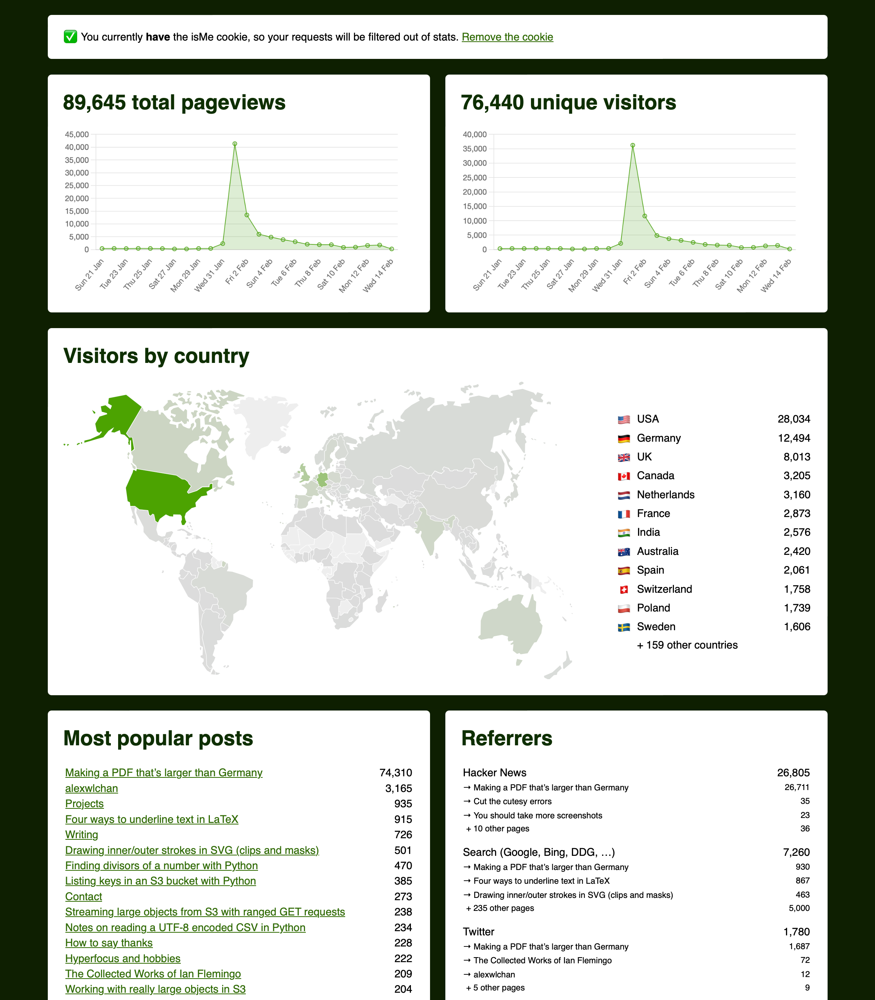

## analytics.alexwlchan.net

This is a tiny Flask app for counting visitors to my websites (alexwlchan.net and its subdomains).
My goals for this project are:

*   Collect the data I need to make informed decisions about the site
*   Avoid collecting any Personally Identifiable Information about readers (e.g. IP address)
*   Collect more detailed statistics than Netlify Analytics

## How it works

Each of the websites I want to measure have a small JavaScript snippet that fetch a tracking pixel, which is served by this web app.
The tracking pixel includes some query parameters to tell you what page you were looking at.
e.g.

> https://analytics.alexwlchan.net/a.gif?url=https%3A%2F%2Falexwlchan.net%2F&referrer=https%3A%2F%2Fexample.net%2F&title=alexwlchan

When you fetch the tracking pixel, it records the hit in a SQLite database.
In particular, it records the following fields:

*   The date of the request
*   The URL and title of the page you were looking at
*   The referrer, i.e. which page linked you to my website
*   The country you're in, which is guessed from your IP address
*   An anonymous session identifier, so I can correlate hits within the same session (more on this below)
*   Whether you're a bot or crawler (based on your User-Agent, so I can separate humans from Google's search crawler)

I **don't** record your IP address or user agent.

I can then view the aggregate data in a dashboard:



The dashboard shows me:

*   total pageviews and unique visitors
*   where my visitors are coming from, geographically
*   statistics for most popular and most recent posts (it looks at my RSS feed to see what I've posted recently)
*   the most common referrer source/destination pairs (unlike Netlify Analytics, which just shows you the name of the referrer, but not where traffic is being referred to)

I tidy up some of the data before presenting it in the dashboard, particularly for referrers.
For example, I gather up a dozen or so domain names under a single "Search" heading -- it's useful for me to know that a hit came from a search result, but I don't need it broken down by different search engines.

## Privacy considerations (aka don’t be creepy)

### Anonymous session identifier

I want to count unique visitors to the site.

This means I need a way to correlate requests from the same visitor.
If I got three hits in quick succession, did they come from three people looking at one page each, or one perso looking at three pages?

To correlate requests, I create an anonymous session identifier which gets attached to each request.
This is a randomly-assigned UUID that's attached to all requests coming from your (IP address, User-Agent) combination.
It lasts for a single day, after which it expires and your requests get a new UUID.

This session identifier doesn't include your IP address or User-Agent.
I don't record your raw IP address or User-Agent anywhere.

This means that I can see that a person looked at several pages in a single day, but I can't tell who that person is, and I can't tell you what they looked at over a span of multiple days.

### Matching IP addresses to geographic locations

I record the country associated with an IP address in the database - I don't need anything more granular than that.

To do geolocation lookups of IP addresses, I have a [MaxMind database][maxmind] that allows me to do the matching in an on-disk database.
This means I can do the country lookups without sending all my visitors' IP addresses to an external service.
Ick!

[maxmind]: https://www.maxmind.com/en/home

## Installation

```console
$ git clone git@github.com:alexwlchan/analytics.alexwlchan.net.git
$ cd analytics.alexwlchan.net
$ python3 -m venv .venv
$ source .venv/bin/activate
$ pip install -r requirements.txt
$ pip install -e .
```

## Usage

To run a local server in debug mode:

```console
$ flask --app analytics.app run --debug
```

To start the web server:

<!-- TODO: Store session IDs in SQLite so they can be shared across threads -->

```console
gunicorn analytics:app \
  --workers 1 \
  --bind 127.0.0.1:8007 \
  --access-logfile access.log \
  --log-file app.log \
  --pid analytics.pid \
  --daemon
```

To restart the server:

```console
$ kill -HUP (cat analytics.pid)
```

After you restart the server, load a page (e.g. /privacy/) and use this snippet to see the last recorded hit:

```console
$ sqlite-utils query requests.sqlite 'select * from events order by date desc limit 1'
```

To send data to the server, add the following tracking snippet to the page:

```html
<script>
  window.onload = function() {
    const analyticsData = new URLSearchParams({
      "url": window.location.href,
      "referrer": document.referrer,
      "title": document.title,
    });

    fetch(`https://analytics.alexwlchan.net/a.gif?${analyticsData.toString()}`, { credentials: 'include' })
      .then(resp => console.log(resp));
  }
</script>
```

## UTM parameters

I have a small number of `utm_source` parameters I add to my own links I share:

* `utm_source=mastodon` – links I post on Mastodon
* `utm_source=rss` – links in my RSS feed

## License

MIT.
